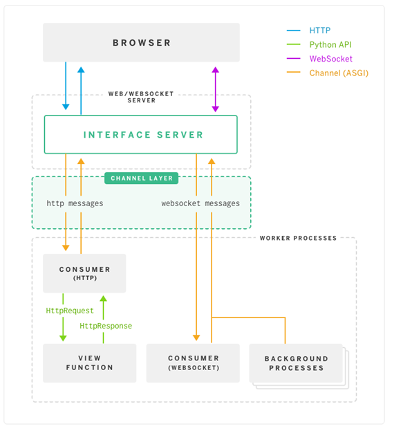
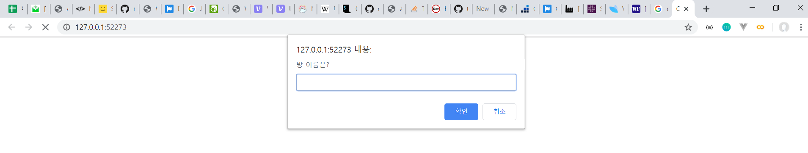
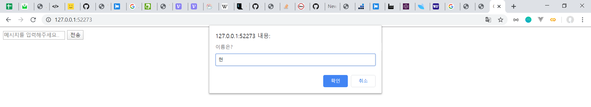
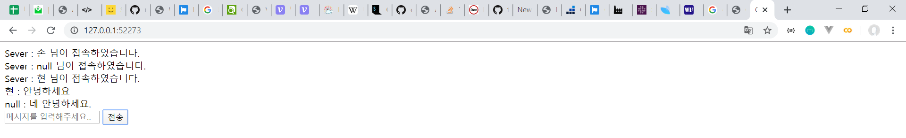
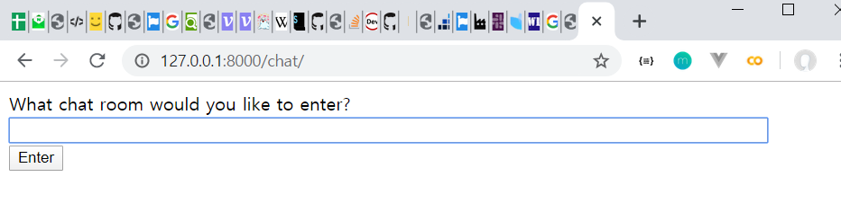
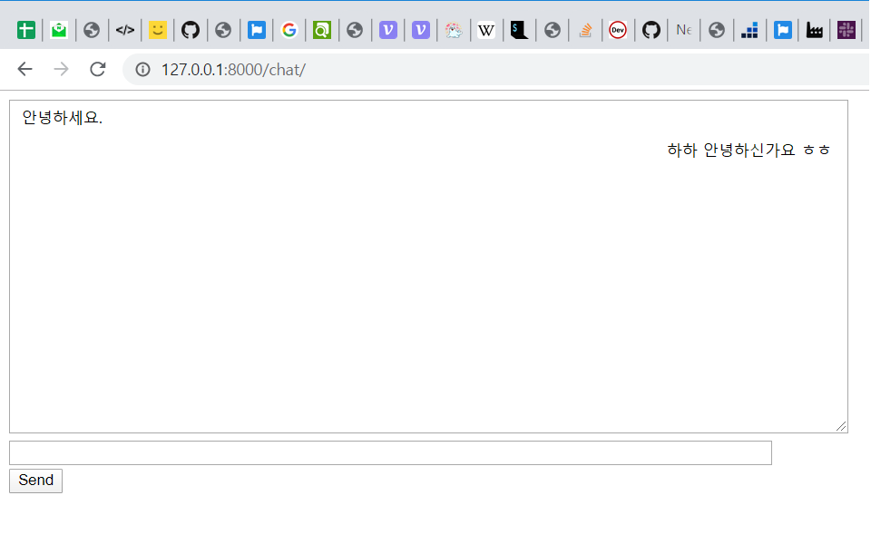

# Chatroom 구현하기

### 1. 목표

​		i. socket에 대하여 이해하기

​		ii. 다양한 framework를 이용하여 chatroom 구현하기 

### 2. 핵심 기능

#### NodeJs

* socket 통신을 이용하여 비동기적으로 연동할 수 있는 chatting 방을 구현했다.
* URL에 접속 시 prompt로 방 이름을 입력하도록 하여 방 이름이 같은 user만 연결하도록 하였다.
* 또한 접속자 이름을 받아 이름도 대화내용과 함께 보이도록 하였다.

app.js

```python
const socketIo = require('socket.io');
const express = require('express');
const http = require('http');
const fs = require('fs');

const app = express();
const server = http.createServer(app);
const io = socketIo.listen(server);

app.use(express.static(`${__dirname}/static`));

app.get('/', function(request, response) { 
    fs.readFile('./static/index.html', function (err, data) {
        if (err) {
            response.send(err)
        } else {
            response.writeHead(200, {'Content-Type': 'text/html'})
            response.write(data)
            response.end()
        };
    });
});

io.sockets.on('connection', (socket) => {
    let roomName=null;

    socket.on('join', (data) => {
        roomName = data.roomName;
        socket.join(data.roomName);
        io.sockets.in(roomName).emit('join', data)
    });

    socket.on('newUser', function(name) {
        console.log(name+' 님이 접속하였습니다.')
        socket.name = name
        io.sockets.in(roomName).emit('message', {type:'connect', name:'Sever', message: name + ' 님이 접속하였습니다.'})
    });

    socket.on('message', (data) => {
        data.name = socket.name
        io.sockets.in(roomName).emit('message', data)
    });

    socket.on('disconnect', function() {
        console.log(socket.name + '님이 나가셨습니다.')
        io.sockets.in(roomName).emit('message', {type:'disconnet', name: 'SERVER', message: socket.name + ' 님이 나가셨습니다.'})
    });
})

server.listen(52273, () => {
    console.log('Server Running at http://127.0.0.1:52273');
});
```

index.html

```html
<!DOCTYPE html>
<html lang="en">
<head>
    <meta charset="UTF-8">
    <script src="/socket.io/socket.io.js"></script>
    <title>Chat page</title>
</head>
<body>
    <div class="container">
        <div id="chat">
        </div>
        <div>
            <input type="text" id="test" placeholder="메시지를 입력해주세요..">
            <button id="submit" onclick="send()">전송</button>
        </div>
    </div>
    <script>
        var socket = io.connect();
        var roomName = prompt('방 이름은?', '');

    
        socket.emit('join', {
        roomName: roomName
        });

        socket.on('join', () => {
            var name = prompt('이름은?', '');
            socket.emit('newUser', name);
        })
        
        socket.on('message', function(data) {
            console.log(data)
            var message = document.createElement('div')
            var chat = document.getElementById('chat')
            var node = document.createTextNode(`${data.name} : ${data.message}`)
            message.appendChild(node)
            chat.appendChild(message)
        });

        var button = document.getElementById('my_button');
        send = function () {
            var message = document.getElementById('test').value
            document.getElementById('test').value = ''
            socket.emit('message', {
                message: message
            });
        };

    </script>
</body>
</html>
```


#### Django

* Django에서 제공하고 있는 Channels를 이용하여 구현했다.

* Django 자체는 동기식이지만, Channels를 사용하면 연결과 소켓을 비동기 처리한다.

* Web socket, Redis를 사용하여 채널을 관리했다.

  
  
  

### 3. 사이트 세부 기능과 이미지

####  NodeJs 







#### Django





### 4. 프로젝트를 마치며

운영체제를 공부하다가 동기, 비동기를 배우고 생각해보니 동기적으로 실행되는 프로그램만 구현해보았다는 생각이 들었다. 따라서, 비동기적으로 동작해야되는 것에 대하여 시도해보고자 채팅을 구현했다. 

채팅방을 만드는 것은 생각보다 매우 복잡하였다. 이 전에 해보았던 프로젝트 중 comment를 구현하는 것이 있었는데 이것과 동기/비동기 작동만 다르고 크게 다르지 않을 것이라고 생각하고 시작했다. 그러나 비동기적으로 동작하도록 하는 것이 매우 어렵다는 것을 깨달았고 결국 첫 채팅방은 Nodejs로 40시간 이상 노력해서 겨우 구현할 수 있었다. 이 후 다른 framework인 django로 구현할 때는 비교적 쉽고 빠르게 구현할 수 있었다.

여러 framework를 시도해보는 것은 개발자에게 매우 좋은 경험이라고 생각한다. 본 프로젝트에서 Nodejs로 구현하는 것이 매우 어려웠기 때문에 다른 framework로도 시도해봐서 제대로 익히고 싶다는 생각이 들어 시도하였고 좋은 도전이 되었다.
